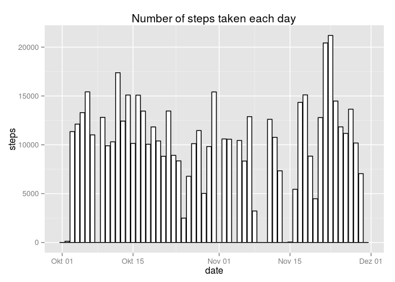
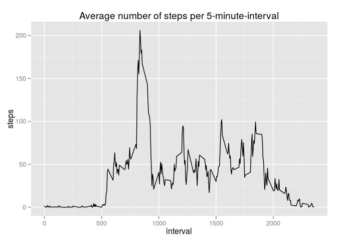
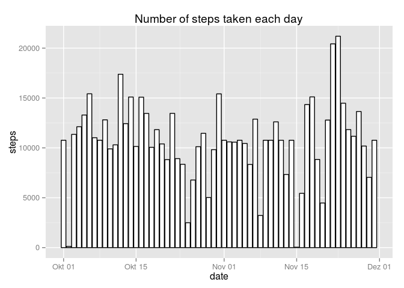
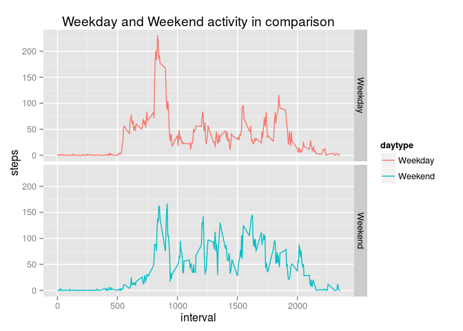

# Reproducible Research: Peer Assessment 1


## Loading and preprocessing the data

First, we load the dataset stored in "activity.csv".

```r
activity <- read.csv("activity.csv")
```

Then we convert the date column to date type.

```r
activity$date <- as.Date(activity$date)
```

## What is mean total number of steps taken per day?

We first summarise the steps per day using the plyr package.

```r
library(plyr)
activity_by_day <- ddply(activity, .(date), summarise, steps=sum(steps,na.rm=TRUE))
```

Now, we can plot a histogram of the total daily steps. Because we use ggplot2, it
has to be loaded first.

```r
library(ggplot2)
ggplot(activity_by_day, aes(x=date,y=steps), xlab="Steps per day", ylab="Count") + geom_histogram(stat="identity", binwidth=1000, colour="black", fill="white") + ggtitle("Number of steps taken each day")
```

 

Then we calculate the mean and median of the total number of steps per day.

```r
mean_steps <- mean(activity_by_day$steps, na.rm=TRUE)
print(mean_steps)
```

```
## [1] 9354.23
```

```r
median_steps <- median(activity_by_day$steps, na.rm=TRUE)
print(median_steps)
```

```
## [1] 10395
```

## What is the average daily activity pattern?
We now want to analyze the average number of steps in the recorded 5-minute-intervals. 

To do this, we first calculate the average number of steps grouped by the intervals.

```r
activity_by_interval <- ddply(activity, .(interval), summarise, steps=mean(steps, na.rm=TRUE))
```

Now we can plot the intervals (x axis) against the previously computed averages (y axis).

```r
ggplot(activity_by_interval, aes(x=interval,y=steps), xlab="Interval", ylab="Average number of steps") + geom_line() + ggtitle("Average number of steps per 5-minute-interval")
```

 

Using the preprocessed data we can now easily find out in which interval on average
across all days the most steps were taken.

```r
activity_by_interval[which.max(activity_by_interval$steps),]
```

```
##     interval    steps
## 104      835 206.1698
```
As we can see from the output, most steps were taken in interval 835 which equals to
1:55pm. 

## Imputing missing values
Up to this point, we have ignored missing values in the data. This may introduce a bias
into the calculation of mean, median and other summaries. 

Before imputing missing values, we first check how many rows have missing values.

```r
sum(!complete.cases(activity))
```

```
## [1] 2304
```

There are different strategies for imputing missing values. We here use the average
number of steps for the 5-minute-interval and save the modified dataset to a new one.

```r
activity_imputed <- activity
ids_with_NAs <- which(!complete.cases(activity))
for(id in ids_with_NAs) {
    id_interval <- activity[id,]$interval
    mean_for_interval <- activity_by_interval[which(activity_by_interval$interval==id_interval),]$steps
    activity_imputed[id,]$steps <- mean_for_interval
}
```

Having imputed the values we again create a histogram of the total number of steps taken
each day. 

```r
activity_imputed_by_day <- ddply(activity_imputed, .(date), summarise, steps=sum(steps))
ggplot(activity_imputed_by_day, aes(x=date,y=steps), xlab="Steps per day", ylab="Count") + geom_histogram(stat="identity", binwidth=1000, colour="black", fill="white") + ggtitle("Number of steps taken each day")
```

 

Also we again calculate the *mean* and *median* values. 

```r
mean_imputed_steps <- mean(activity_imputed_by_day$steps, na.rm=TRUE)
print(mean_steps)
```

```
## [1] 9354.23
```

```r
median_imputed_steps <- median(activity_imputed_by_day$steps, na.rm=TRUE)
print(median_steps)
```

```
## [1] 10395
```

Comparing the values with the ones calculated above we see that they do not differ noticeably.
The histograms however differ because in the first one we have missing values for some days due
to the fact that we had to ignore the NAs present in the original dataset for the calculation of
the daily sums.

## Are there differences in activity patterns between weekdays and weekends?


To plot the different activity patterns we first summarize the data by interval and
daytype (i.e. weekday or weekend).

```r
activity_imputed$daytype <- weekdays(activity_imputed$date)
activity_imputed$daytype <- ifelse(activity_imputed$daytype == "Saturday" | activity_imputed$daytype == "Sunday", "Weekend", "Weekday")
activity_imputed$daytype <- as.factor(activity_imputed$daytype)
```

Now we can plot the data similar to our plot above but this time with facet grid so
we plot both the weekday and the weekend activity in one grid.

```r
activity_imputed_by_interval <-ddply(activity_imputed, .(interval,daytype), summarise, steps=mean(steps))
ggplot(activity_imputed_by_interval, aes(x=interval,y=steps)) + facet_grid(daytype ~ .) + geom_line(aes(color=daytype)) + ggtitle("Weekday and Weekend activity in comparison")
```

 
